# VoxHAUT Pet Robot on ESP8266

VoxHAUT combines various technologies such as the _ESP8266 NodeMCU 1.0 microcontroller unit_, the _ESP8266 L293DD Motor Shield_, _AHT20 and BMP280 sensor_, _JQ8400 audio synthesis module_, _OLED 0.96 inch display_, and _HR-SC04 ultrasonic sensor_. Designed to function as a pet companion, VoxHAUT integrates seamlessly with Android through a Wi-Fi connection, enabling users to interact and communicate with it effectively.

<p align="center">
    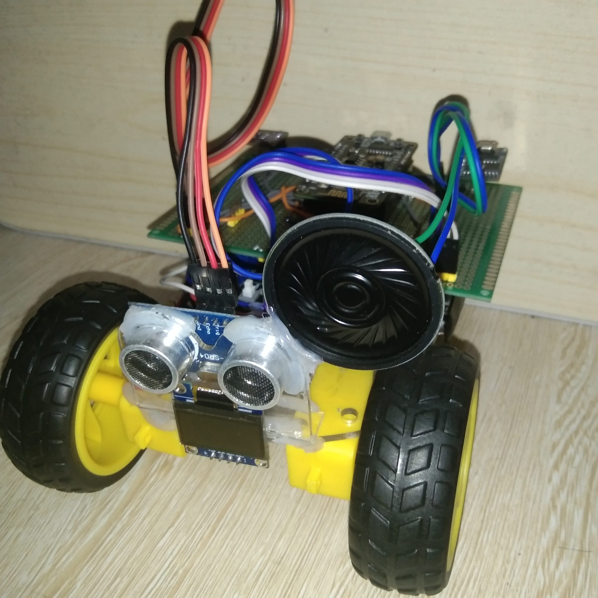
    <br/>
    <i>VoxHAUT on isometric perspective</i>
</p>

The core of the VoxHAUT is the ESP8266 NodeMCU 1.0, a powerful microcontroller that serves as the central control unit. With built-in Wi-Fi capabilities, the NodeMCU facilitates wireless communication between VoxHAUT and the user devices, creating a seamless interface for interaction. This connectivity allows users to control VoxHAUT, receive real-time data, and trigger emotional responses, enhancing the overall interactive experience.

While, the hardware components of the VoxHAUT includes various sensors and modules that contribute to its functionality. The on-board AHT20 and BMP280 sensors enable environmental monitoring by providing accurate measurements of temperature, humidity, and atmospheric pressure. These sensors offer users valuable insights into its surroundings.

The integration of the JQ8400 audio synthesis module allows the VoxHAUT to communicate audibly with users, enhancing its interactive capabilities. Through voice synthesis and audio playback, the VoxHAUT can provide sentence response and engage users in a more immersive manner.

Moreover, the OLED 0.96" Display serves as the visual interface of VoxHAUT, conveying emotions and displaying important information such as status updates and environmental data. This clear and vibrant display enables users to interpret the VoxHAUT's current state and interact accordingly, fostering a deeper connection between users and the robot.

To ensure safe navigation, the VoxHAUT incorporates ultrasonic sensor that mimic eyes. These sensors enable obstacle avoidance functionality, allowing the VoxHAUT to detect and navigate around obstacles intelligently. This feature enhances the VoxHAUT's autonomy and ensures a smooth and reliable user experience.

By combining these hardware components and technologies, the VoxHAUT with ESP8266 NodeMCU 1.0 provides users with an interactive pet-like companion. Users can control the VoxHAUT, receive real-time data, trigger emotional responses, and engage in meaningful interactions through the provided Android application. And with its unique blend of functionality and interactivity, the VoxHAUT with ESP8266 NodeMCU 1.0 offers an exciting and immersive user experience, making it an ideal choice for those seeking a technologically advanced pet-like companion.

This repository contains the complete source code, hardware setup instructions, and additional documentation for the VoxHAUT project.

## Pictures of VoxHAUT

| Front View                   | Side View                   | Top View                   |
|------------------------------|-----------------------------|----------------------------|
| 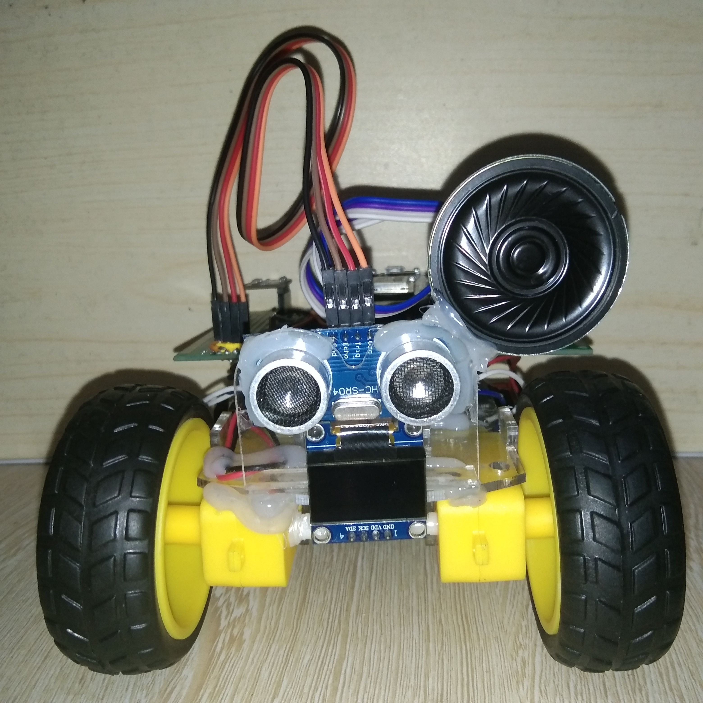 | 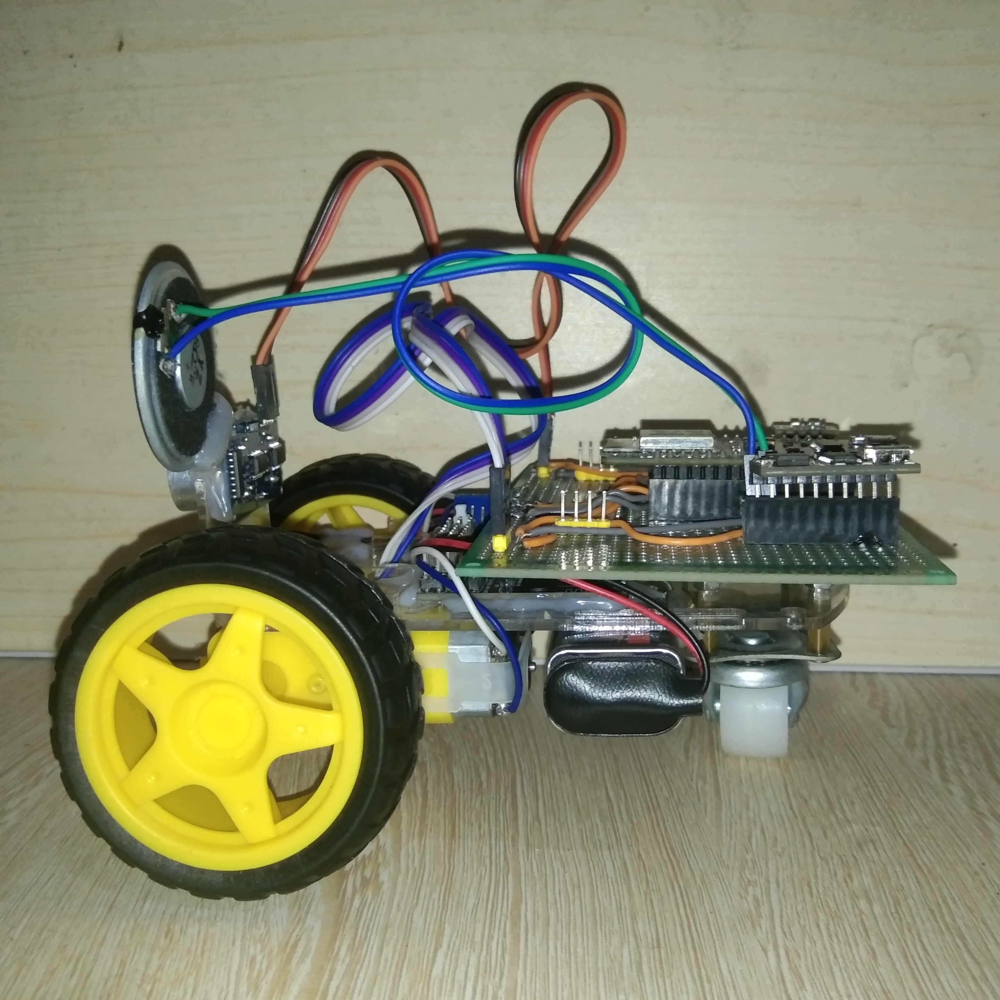 | 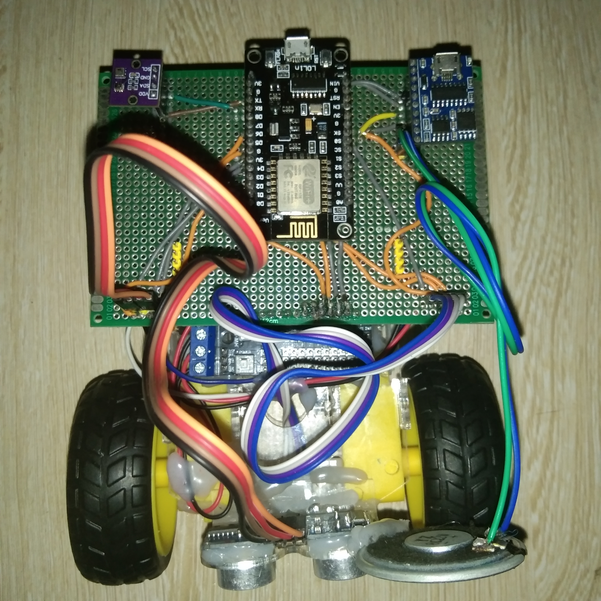 |

## Features

- **WiFi Connectivity**: The VoxHAUT utilizes the ESP8266 NodeMCU 1.0 microcontroller unit to establish a wireless connection with Android application via WiFi. This allows seamless interaction between the user and the robot, enabling a wide range of functionalities and commands.

- **Android App Interaction**: Users can control and interact with the VoxHAUT with an Android application. The Android app is developed using TypeScript and ReactJS and wrapped within an Android WebView written in Kotlin.

- **Emotional Display**: The VoxHAUT features an OLED 0.96 inch display that visually expresses emotions such as happiness, sadness, and idleness. When users interact with VoxHAUT, it displays a happy emotion, creating a friendly and engaging atmosphere. In the absence of user interaction, the display shows a sad emotion, indicating VoxHAUT's longing for attention.

- **Audio Synthesis**: To enhance the interactive experience, the VoxHAUT incorporates the JQ8400 audio synthesis module. It is capable of generating synthesized speech, sound effects, and music. This feature enables the robot to communicate with the user in a more engaging and expressive manner.

- **Environmental Sensors**: The on-board AHT20 and BMP280 sensors enables VoxHAUT to monitor its surroundings. The AHT20 sensor measures temperature and humidity, while the BMP280 sensor provides atmospheric pressure and temperature data.

- **Obstacle Avoidance**: VoxHAUT employs ultrasonic sensors to mimic the depiction of eyes and facilitate obstacle avoidance. By measuring the distance to nearby objects, it can autonomously navigate its environment, avoiding potential collisions. This safety feature ensures the smooth operation of the robot while ensuring the well-being of both the robot and its surroundings.

## Functionality

The primary objective of VoxHAUT is to provide users with a virtual pet experience through interaction with its Android application.

- **Pet-like Interaction**: The primary purpose of VoxHAUT is to serve as a pet-like companion. Users can interact with the robot using the Android application, issuing commands, playing sounds, and engaging in conversations. The robot responds with synthesized speech, expressive emotions on the OLED display, and appropriate movements.

- **Environment Monitoring**: The AHT20 and BMP280 sensors provide real-time environmental data to the Android application. Users can access information such as temperature, humidity, atmospheric pressure, and altitude, enabling them to monitor its surroundings remotely.

- **Speech Synthesis**: The JQ8400 audio synthesis module enables the VoxHAUT to speak in response to user interactions. Using pre-recorded audio samples, the module generates speech, providing a personalized and engaging experience for users.

- **Emotional Feedback**: The OLED 0.96 inch display serves as a visual feedback mechanism, reflecting the emotional state of the VoxHAUT. The display showcases happiness when the robot receives user interaction, reinforcing the feeling of companionship. When left idle for an extended period, the display exhibits a sad emotion, encouraging users to engage with the robot.

## Getting Started

To get started, follow the steps below to build the robot:

1. Wire up the components and follow the [schematics](#Schematics), see next section.
2. Run the `upload-firmware.bat` file from the [build/](build/) folder. It should smoothly upload the codes to the ESP8266 NodeMCU. Make sure you have PlatformIO installed.

To build the Android app, follow the steps below:

1. First, run the `npm-module-installer.bat` then the `build-sketch.bat`, and finally `asset-mover.bat`. All of which are located on the [build/](build/) folder.
2. Now, from the Android Studio, open the folder [src/app/Talk2VoxHAUT]. You can now build the project.

Happy building!

## Schematics

The schematics are freely available on the folder [schematics/](schematics/) available on both PDF and PNG format.

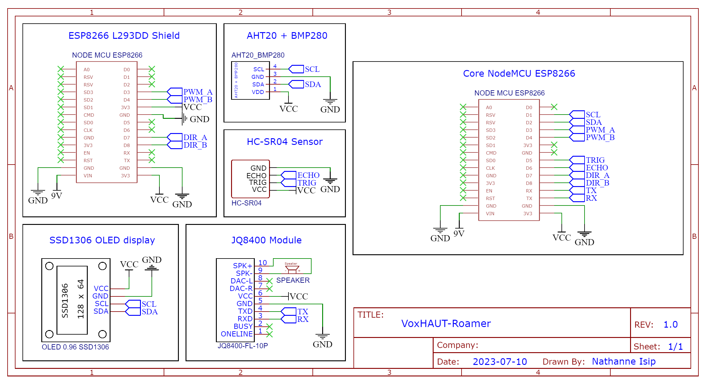

## Hardware Components

VoxHAUT is built with an ESP8266 NodeMCU 1.0, a versatile microcontroller unit board, and the ESP8266 L293DD Motor Shield, which enables precise control of its motors. It features an on-board AHT20 and BMP280 sensor for temperature and barometric pressure measurements. Additionally, it incorporates the JQ8400 audio synthesis module to produce speech, an OLED 0.96-inch display to convey emotions, and ultrasonic sensors for obstacle avoidance.

1. __ESP8266 NodeMCU 1.0__: This central control unit is based on the ESP8266 microcontroller, providing robust processing power and Wi-Fi connectivity. It serves as the brain of VoxHAUT, coordinating its operations and enabling wireless communication with user devices.

<p align="center">
    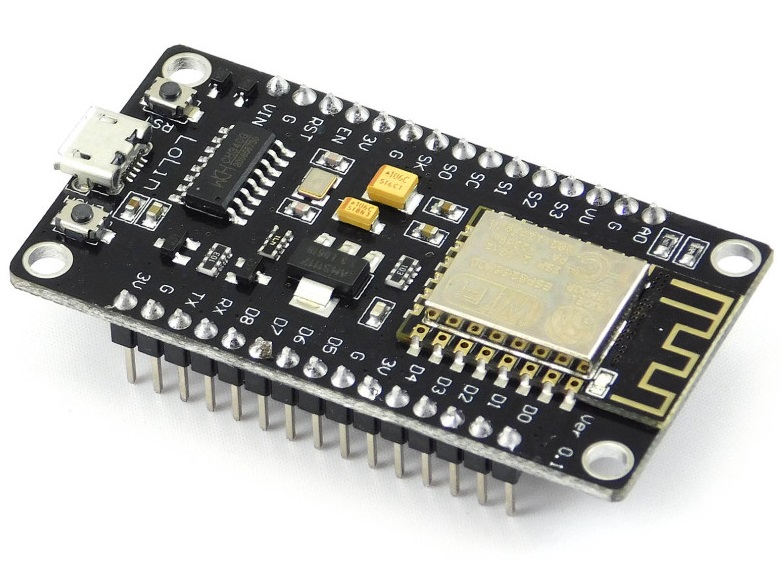
</p>

2. __ESP8266 L293DD Motor Shield__: The motor shield offers precise control over VoxHAUT's movements. It interfaces with the ESP8266 NodeMCU, providing the ability to drive motors with accuracy, allowing smooth navigation and control.

<p align="center">
    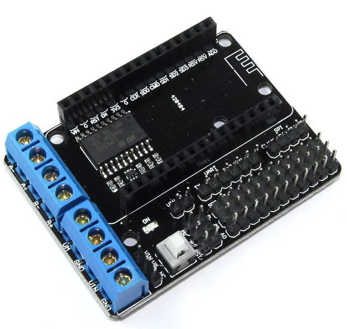
</p>

3. __AHT20 + BMP280 Sensor__: An on-board temperature and humidity sensor for environmental monitoring and a sensor module used to measure atmospheric pressure and temperature. It provides accurate measurements of temperature and humidity, enabling real-time environmental data tracking. And by incorporating these sensors into the VoxHAUT, users can monitor and analyze atmospheric conditions in real-time.

<p align="center">
    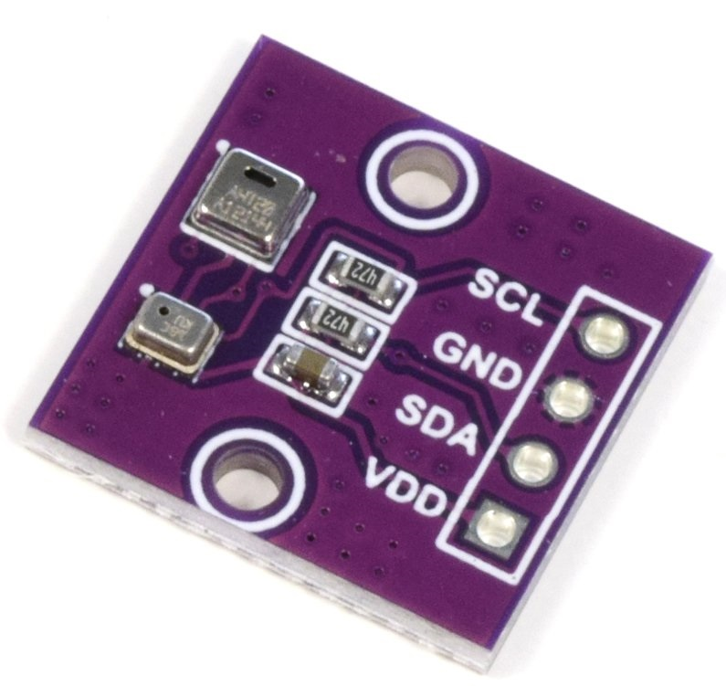
</p>

4. __JQ8400 Audio Synthesis Module__: This audio synthesis module enhances VoxHAUT's interaction capabilities by enabling voice synthesis and audio playback. It allows VoxHAUT to communicate with users audibly, providing a more immersive experience.

<p align="center">
    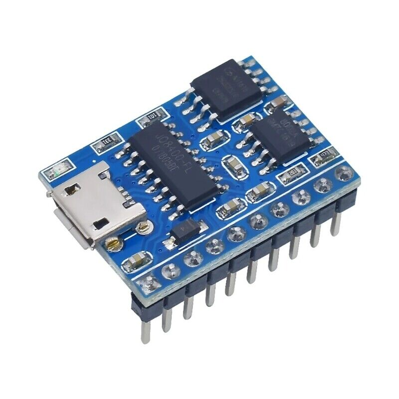
</p>

5. __OLED 0.96 Inch Display__: The OLED display serves as the visual interface of the VoxHAUT, measuring 0.96 inches. It is used to convey emotions. With its clear and vibrant display, users can easily interpret VoxHAUT's current state and interact accordingly.

<p align="center">
    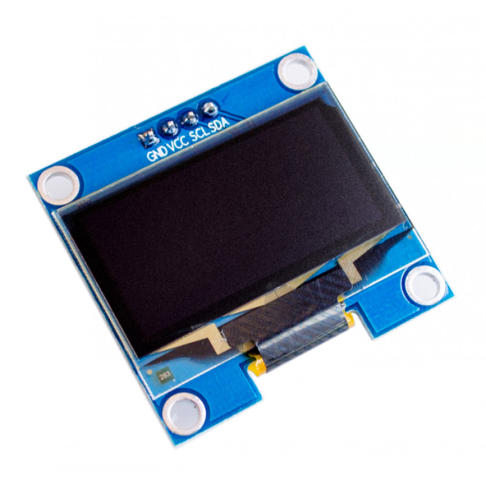
</p>

6. __HC-SR04 Ultrasonic Sensor__: The VoxHAUT incorporates ultrasonic sensors to mimic eyes and enable obstacle avoidance functionality. By emitting ultrasonic waves and measuring the echo time, the sensors determine the presence and distance of obstacles in its path. This allows VoxHAUT to navigate intelligently, avoiding collisions and ensuring a safe and smooth user experience.

<p align="center">
    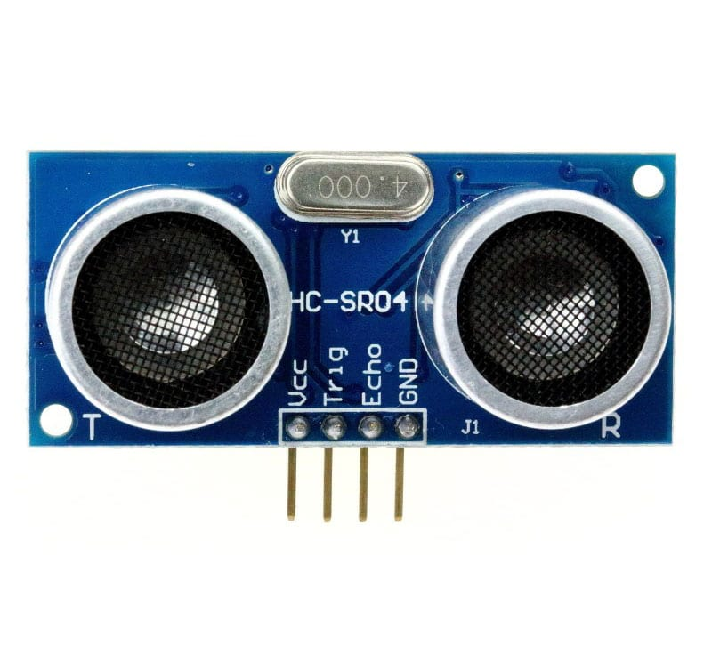
</p>

The seamless integration of these hardware components empowers VoxHAUT with ESP8266 NodeMCU 1.0 to provide a comprehensive and engaging user interaction, environmental monitoring, and obstacle avoidance capabilities.

## License

```
Copyright 2023 Nathanne Isip

Licensed under the Apache License, Version 2.0 (the "License");
you may not use this file except in compliance with the License.
You may obtain a copy of the License at

    http://www.apache.org/licenses/LICENSE-2.0

Unless required by applicable law or agreed to in writing, software
distributed under the License is distributed on an "AS IS" BASIS,
WITHOUT WARRANTIES OR CONDITIONS OF ANY KIND, either express or implied.
See the License for the specific language governing permissions and
limitations under the License.
```